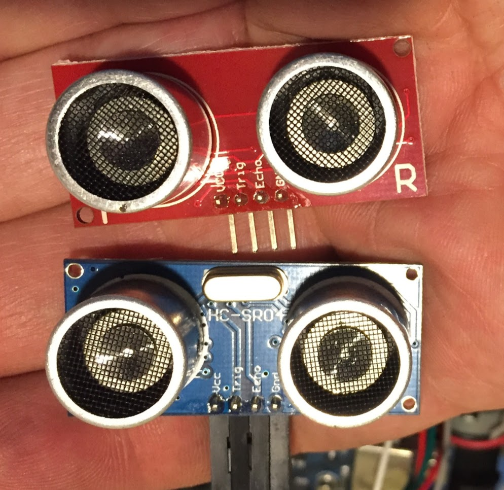

# ZipRunt Rover Arduino workshop code and sensor mount

Originally developed for a class at YouDoit Electronics in Needham.

Arduino directory contains required libraries and sample code.
Fabricate contains design files for the sonar sensor holder.

There's a new version of the HCSR04 out that doesn't have the crystal on the front (it's not there at all). The v2 mount is for that sensor. Note the sensor is mounted upside down to ease plugging wires in to the top.

